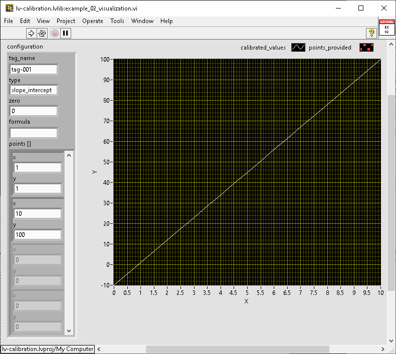

# lv-calibration

lv-calibration is a library that provides the ability to convert from raw data to calibrated/scaled data. In data acquisition applications, you commonly read raw data (e.g., volts or amps) and then have to convert it to units that make a bit more sense (e.g., pounds per square inch, gallons). This library can be used to do the following:

* Perform scaling/calibration using the methods: slope intercept, linear_fit, polynomial fit, interpolation and formula)
* Perform zeroing separate from scaling/calibration
* Functions for storing serializing configuration and accessing it at runtime
* Functions for converting from raw to calibrated functions

> Keep in mind that this library is specifically for *calibration* NOT scaling, see [https://github.com/antonio-alexander/lv-unit-conversion](https://github.com/antonio-alexander/lv-unit-conversion) if you're interested in converting from one unit to another. Although this DOES do the job of covnerting from raw to scaled, it's purpose is the initial conversion, not subsequent conversions.

You can copy+paste the library itself or use VIPM to install (this is the method I suggest).

## Initialization and Configuration

This is probably the only "complex" functionality within this library; it works off of the idea that runtime configuration MUST be faster than how you'd store the configuration on disk (i.e. serialized). This is accomplished by having a private runtime configuration and a public configuration that can be serialized. The runtime configuration is slightly different, but some of the functions can be simplified to simple arithmetic, but not all (hence the separate configurations).

The above example is a basic idea of how to perform initialization and generate runtime configuration to be used for calibration. This is a polymorphic VI that can also take arrays as inputs for tag_name, and value_raw (iteration depends on the input of value_raw).

## Calibration

The following calibration methods are supported:

* Slope Intercept: this is a two point calibration, if only one point is given, one of the points is assumed to be 0,0
* Linear Fit: this is a multi-point calibration which will take three or more points (two points would be a slope intercept) and generate a best fit line between those points; this is a straight line
* Polynomial Fit: this is similar to the linear fit except that the line will curve depending on the points
* Interpolation: this is slightly different in that it will use the points closest to each other, although we'll hae a visual below you can think of this as using straight lines to approximate a circle (e.g. the more points you add the closer it is to a circle)
* Formula: this is just a formula input for completeness, it uses gmath and the input value is represented as x with the output value as y

Below are some images showcasing how the different calibration methods can affect output values. These should be pretty self-explanatory:

## Error Handling

Some error handling is provided upon initialization and runtime functionality; possible errors are:

* Unsupported calibration type
* Tag Name Not Found
* Duplicate Tag Names
* Formula Empty (and configured)

These errors can be re-created using the error.vi

## Zeroing

The configuration provides a field to enter a zero value; this can be used as a way to bring the overall value down without coupling the zero to your offset (e.g. for a two point calibration). This value is subtracted from any calibrated value and is done last (the same time as the offset).
